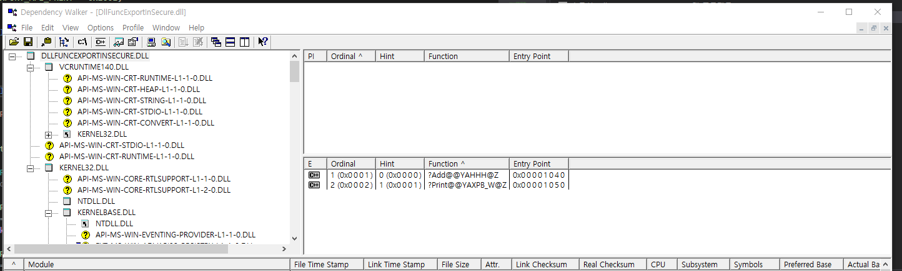

# DllFuncExportInSecure
This is a sample to export function in secure without using export syntax in win32 dll

# The Concept
The idea of exporting function without general way is that we find a main address of dll and call it with a appropriate prototype dll to ask a export function address

I added 'Add' and 'Print' function on DllFuncExportInSecure.dll in a general export way as you can see using toos like 'depends.exe'.
those functions are exported so that any users can get those functions as long as they know the prototype of exported functions.

However, you may want to provide those features to only trusted users by hiding export functions. In order to do so, this repo contains an example of a way to find main address of dll and get functions with a key.

